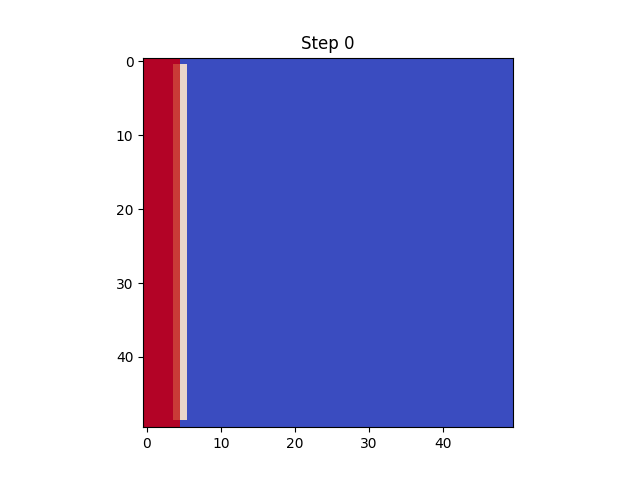
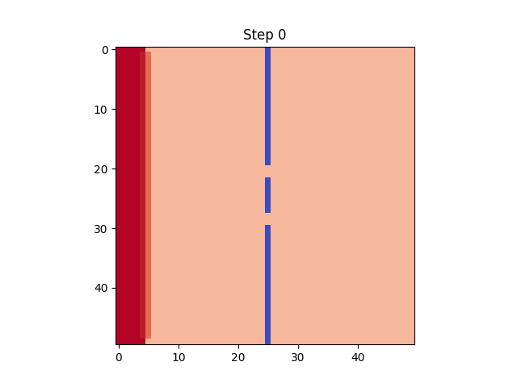

# room_simulation_2d
# 2D流体シミュレーション（移流・拡散モデル）

## 概要
Pythonを用いて、移流・拡散方程式に基づく2次元の流体シミュレーションを実装しました。  
境界条件（壁・開口部）の違いによって流体の挙動がどのように変化するかを可視化しています。

---

## シミュレーション結果
###壁なし


###壁あり


###穴あり

---

## 使用技術
- Python（NumPy, Matplotlib）
- 数値計算（有限差分法）
- 移流・拡散モデル（Advection–Diffusion）

---

## 実装内容
- 2次元格子上でのスカラー場の時間発展
- 移流項・拡散項を組み合わせた数値計算
- 壁・開口部の導入による境界条件の変更
- GIFによる可視化

---

## 工夫した点
- 壁付近での不自然な挙動（吸い込み）を改善するため、境界条件を調整
- 壁の有無・開口部の有無で挙動を比較し、現象の違いを分析
- 開口部における流れの集中と、その後の拡散の様子を再現

---

## 結果・考察
境界条件の違いにより、流体の挙動が大きく変化することを確認した。  
壁がない場合は移流と拡散により滑らかに広がる一方、壁がある場合は流れが遮られ、別方向へ再分配された。  
また、開口部を設けることで流れが集中し、その後拡散する様子が見られた。  

なお、本モデルは圧力項を含まない簡易モデルであるため、実際の流体のような反射や渦は再現できていません。

---

## 今後の展望
- 速度場の導入
- 圧力項を含むモデル（Navier–Stokes方程式）への拡張
- より現実的な流体挙動の再現

---

## 実行方法
```bash
pip install numpy matplotlib imageio
python simulation.py
